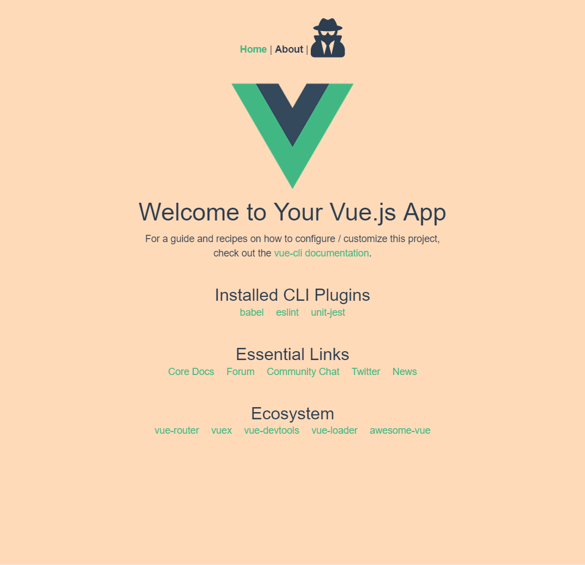

# Vue-Boostrap-template

## Purpose

Setting up [Bootstrap](https://bootstrap-vue.js.org/) & [font-awesome](https://github.com/FortAwesome/vue-fontawesome) on Vue.js is annoying, so make it easy.

## Template



## Project setup
```
npm install
```

### Compiles and hot-reloads for development
```
npm run serve
```

### Compiles and minifies for production
```
npm run build
```

### Run your tests
```
npm run test
```

### Lints and fixes files
```
npm run lint
```

### Run your unit tests
```
npm run test:unit
```

### Customize configuration
See [Configuration Reference](https://cli.vuejs.org/config/).
